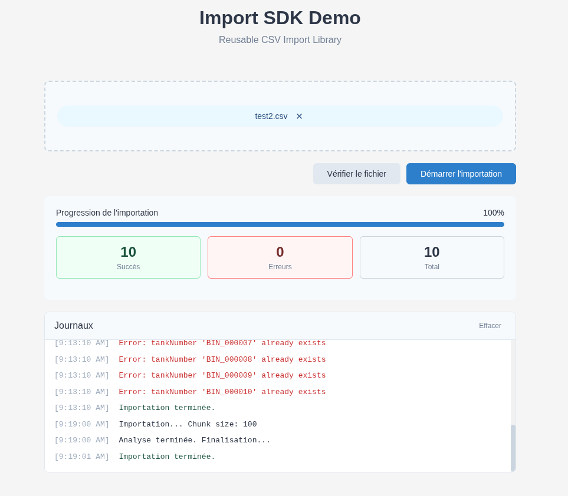
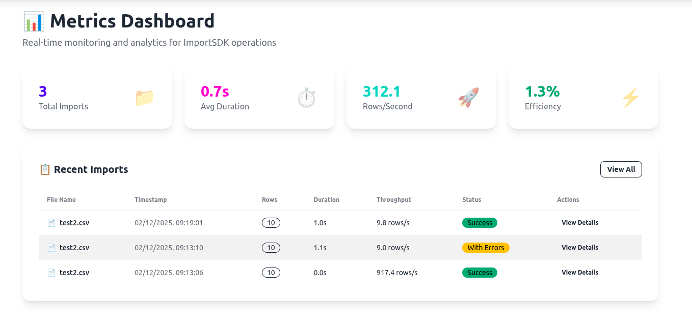

# ImportSDK

A lightweight, reusable JavaScript library for importing CSV files in chunks to any API endpoint.

## Documentation

[ImportSDK Website](https://javimosch.github.io/import-sdk)

[ImportSDK Online Documentation](https://javimosch.github.io/import-sdk/documentation)

[ImportSDK Online Examples](https://javimosch.github.io/import-sdk/frontend/index)

[ImportSDK GIT Documentation](frontend/README.md)


## Demo

The demo shows how to use the library to import a CSV file in chunks to an API endpoint.

### Frontend

```
npx serve . -l 3006
```

### Backend

```
PORT=3011 npm run start
```

### Metrics

```
npm run start  //PORT=3012
```

## Screenshots

### UI



### Metrics

